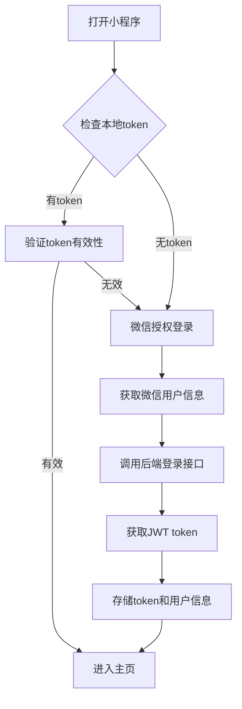

# 校园电动车违规管理系统 - 微信小程序版本

## 项目概述

### 项目背景

本项目是"电动车校园轨迹检察"大学生创新创业项目的移动端实现，基于uniapp框架开发微信小程序，为校园师生提供便捷的电动车违规查询、轨迹回溯等功能。

### 核心功能

- **用户认证**: 微信授权登录、手机号绑定、密码管理
- **违规查询**: 违规通报查看、个人违规记录管理
- **轨迹回溯**: 电动车行驶轨迹查看、电子围栏管理
- **数据可视化**: 违规统计大屏、实时监控

## 技术架构

### 开发框架

- **框架**: uniapp (Vue 3 + TypeScript)
- **UI组件库**: uni-ui + uview-plus
- **状态管理**: Pinia
- **网络请求**: uni.request + axios
- **路由管理**: uniapp内置路由

### 第三方服务

- **地图服务**: 腾讯地图SDK (轨迹展示、围栏绘制)
- **推送服务**: 微信小程序推送
- **文件上传**: 微信小程序文件API
- **位置服务**: 微信小程序定位API

### 技术栈详情

```json
{
  "开发框架": "uniapp",
  "Vue版本": "3.x",
  "TypeScript": "支持",
  "UI库": "uview-plus + uni-ui",
  "状态管理": "Pinia",
  "网络请求": "uni.request + axios封装",
  "地图组件": "腾讯地图",
  "构建工具": "HBuilderX",
  "包管理": "npm/yarn"
}
```

## 项目结构

### 目录结构

```
campus-violation-miniapp/
├── components/           # 公共组件
│   ├── ui/              # UI基础组件
│   ├── business/        # 业务组件
│   │   ├── violation-card.vue    # 违规卡片
│   │   ├── filter-panel.vue      # 筛选面板
│   │   ├── map-track.vue         # 轨迹地图
│   └── common/           # 通用组件
├── pages/               # 页面
│   ├── auth/            # 认证相关
│   │   ├── login.vue           # 登录页
│   │   ├── register.vue        # 注册页
│   │   └── reset-password.vue  # 重置密码
│   ├── home/            # 主页
│   │   └── index.vue           # 首页
│   ├── violation/       # 违规相关
│   │   ├── report.vue          # 违规通报
│   │   ├── my-violations.vue   # 我的违规
│   │   └── detail.vue          # 违规详情
│   ├── track/           # 轨迹相关
│   │   ├── index.vue           # 轨迹主页
│   │   ├── playback.vue        # 轨迹回放
│   │   └── fence.vue           # 电子围栏
│   └── profile/         # 个人中心
│       ├── index.vue           # 个人资料
│       └── settings.vue        # 设置
├── static/              # 静态资源
│   ├── images/          # 图片资源
│   ├── icons/           # 图标资源
│   └── fonts/           # 字体文件
├── stores/              # 状态管理
│   ├── user.js          # 用户状态
│   ├── violation.js     # 违规状态
│   └── system.js        # 系统状态
├── utils/               # 工具函数
│   ├── request.js       # 网络请求封装
│   ├── auth.js          # 认证工具
│   ├── storage.js       # 本地存储
│   ├── date.js          # 日期工具
│   └── validate.js      # 表单验证
├── api/                 # API接口
│   ├── auth.js          # 认证接口
│   ├── violation.js     # 违规接口
│   └── track.js         # 轨迹接口
├── config/              # 配置文件
│   ├── index.js         # 基础配置
│   ├── api.js           # API配置
│   └── constant.js      # 常量定义
├── App.vue              # 应用入口
├── main.js              # 主入口文件
├── manifest.json        # 小程序配置
├── pages.json           # 页面路由配置
└── uni.scss             # 全局样式
```

### 页面路由配置

```javascript
// pages.json
{
  "pages": [
    {
      "path": "pages/home/index",
      "style": {
        "navigationBarTitleText": "首页"
      }
    },
    {
      "path": "pages/auth/login",
      "style": {
        "navigationBarTitleText": "登录"
      }
    }
  ],
  "tabBar": {
    "color": "#7A7E83",
    "selectedColor": "#007AFF",
    "borderStyle": "black",
    "backgroundColor": "#F8F8F8",
    "list": [
      {
        "pagePath": "pages/home/index",
        "iconPath": "static/icons/home.png",
        "selectedIconPath": "static/icons/home-active.png",
        "text": "首页"
      },
      {
        "pagePath": "pages/violation/report",
        "iconPath": "static/icons/violation.png",
        "selectedIconPath": "static/icons/violation-active.png",
        "text": "违规查询"
      },
      {
        "pagePath": "pages/track/index",
        "iconPath": "static/icons/track.png",
        "selectedIconPath": "static/icons/track-active.png",
        "text": "轨迹回溯"
      },
      {
        "pagePath": "pages/profile/index",
        "iconPath": "static/icons/profile.png",
        "selectedIconPath": "static/icons/profile-active.png",
        "text": "我的"
      }
    ]
  }
}
```

## 功能模块设计

### 1. 用户认证模块

#### 微信授权登录流程



#### 登录页面设计

- **界面元素**:

  - 微信一键登录按钮
  - 手机号密码登录选项
  - 注册入口
  - 忘记密码入口
- **交互逻辑**:

  - 优先展示微信登录
  - 支持手机号+验证码登录
  - 记住登录状态7天

### 2. 违规管理模块

#### 违规通报页面

- **功能特性**:

  - 分页加载违规记录
  - 多维度筛选（时间、地点、类型）
  - 实时刷新
  - 下拉刷新/上拉加载更多
- **筛选条件**:

  ```javascript
  const filterOptions = {
    time: ['今天', '昨天', '本周', '本月', '自定义'],
    place: ['东门', '西门', '南门', '北门', '教学楼', '宿舍区'],
    type: ['超速行驶', '违规停放', '闯红灯', '逆行']
  }
  ```

#### 我的违规页面

- **核心功能**:

  - 个人违规记录查询
  - 违规详情查看
  - 轨迹回溯入口
- **违规状态管理**:

  ```javascript
  const violationStatus = {
    PENDING: '待处理',
    PROCESSED: '已处理'
  }
  ```

### 3. 轨迹回溯模块

#### 地图集成方案

- **地图SDK**: 腾讯地图小程序版
- **功能特性**:
  - 轨迹绘制和回放
  - 电子围栏可视化
  - 定位点标记
  - 路径规划

#### 轨迹数据结构

```javascript
interface TrackPoint {
  latitude: number
  longitude: number
  timestamp: number
  speed: number
  direction: number
}

interface TrackData {
  points: TrackPoint[]
  startTime: string
  endTime: string
  totalDistance: number
  maxSpeed: number
  violations: ViolationPoint[]
}
```

## API接口设计

### 基础配置

```javascript
// config/api.js
const API_CONFIG = {
  BASE_URL: 'https://api.campus.edu.cn/api',
  TIMEOUT: 10000,
  RETRY_TIMES: 3
}

const API_ENDPOINTS = {
  AUTH: {
    LOGIN: '/auth/login',
    REGISTER: '/auth/register',
    LOGOUT: '/auth/logout',
    REFRESH_TOKEN: '/auth/refresh',
    SEND_CODE: '/auth/sendCode'
  },
  VIOLATION: {
    LIST: '/violations',
    DETAIL: '/violations/{id}',
    MY_VIOLATIONS: '/violations/my',
    REPORT: '/violations/report'
  },
  TRACK: {
    HISTORY: '/tracks/history',
    REALTIME: '/tracks/realtime',
    FENCE: '/tracks/fence'
  }
}
```

### 请求封装

```javascript
// utils/request.js
class Request {
  constructor(options = {}) {
    this.baseURL = options.baseURL || API_CONFIG.BASE_URL
    this.timeout = options.timeout || API_CONFIG.TIMEOUT
    this.interceptors = {
      request: [],
      response: []
    }
  }

  // 请求拦截器
  addRequestInterceptor(interceptor) {
    this.interceptors.request.push(interceptor)
  }

  // 响应拦截器
  addResponseInterceptor(interceptor) {
    this.interceptors.response.push(interceptor)
  }

  // 统一请求方法
  async request(options) {
    // 应用请求拦截器
    let processedOptions = options
    for (const interceptor of this.interceptors.request) {
      processedOptions = await interceptor(processedOptions)
    }

    try {
      const response = await uni.request({
        url: this.baseURL + processedOptions.url,
        method: processedOptions.method || 'GET',
        data: processedOptions.data,
        header: {
          'Content-Type': 'application/json',
          'Authorization': `Bearer ${getToken()}`,
          ...processedOptions.header
        },
        timeout: this.timeout
      })

      // 应用响应拦截器
      let processedResponse = response
      for (const interceptor of this.interceptors.response) {
        processedResponse = await interceptor(processedResponse)
      }

      return processedResponse
    } catch (error) {
      this.handleError(error)
      throw error
    }
  }

  // 便捷方法
  get(url, data = {}) {
    return this.request({ url, method: 'GET', data })
  }

  post(url, data = {}) {
    return this.request({ url, method: 'POST', data })
  }

  put(url, data = {}) {
    return this.request({ url, method: 'PUT', data })
  }

  delete(url, data = {}) {
    return this.request({ url, method: 'DELETE', data })
  }
}
```

### 认证拦截器

```javascript
// utils/auth.js
const request = new Request()

// 请求拦截器 - 添加token
request.addRequestInterceptor(async (config) => {
  const token = uni.getStorageSync('token')
  if (token) {
    config.header = {
      ...config.header,
      'Authorization': `Bearer ${token}`
    }
  }
  return config
})

// 响应拦截器 - 处理认证错误
request.addResponseInterceptor(async (response) => {
  const { statusCode, data } = response

  if (statusCode === 401) {
    // token过期，尝试刷新
    try {
      const newToken = await refreshToken()
      if (newToken) {
        uni.setStorageSync('token', newToken)
        // 重新发起原请求
        return request.request(response.config)
      }
    } catch (error) {
      // 刷新失败，跳转登录
      redirectToLogin()
    }
  }

  if (statusCode === 403) {
    uni.showToast({
      title: '权限不足',
      icon: 'none'
    })
  }

  return response
})
```

## 状态管理设计

### 用户状态管理

```javascript
// stores/user.js
import { defineStore } from 'pinia'
import { reactive, computed } from 'vue'

export const useUserStore = defineStore('user', () => {
  const state = reactive({
    userInfo: null,
    token: null,
    isLoggedIn: false
  })

  const getters = {
    displayName: computed(() => state.userInfo?.name || state.userInfo?.username || '未登录')
  }

  const actions = {
    // 设置用户信息
    setUserInfo(userInfo) {
      state.userInfo = userInfo
      state.isLoggedIn = true
      uni.setStorageSync('userInfo', userInfo)
    },

    // 设置token
    setToken(token) {
      state.token = token
      uni.setStorageSync('token', token)
    },

    // 登录
    async login(credentials) {
      try {
        const response = await api.auth.login(credentials)
        const { token, userInfo } = response.data

        this.setToken(token)
        this.setUserInfo(userInfo)

        return { success: true }
      } catch (error) {
        return { success: false, error: error.message }
      }
    },

    // 登出
    logout() {
      state.userInfo = null
      state.token = null
      state.isLoggedIn = false

      uni.removeStorageSync('userInfo')
      uni.removeStorageSync('token')
    }
  }

  return {
    ...state,
    ...getters,
    ...actions
  }
})
```

### 违规状态管理

```javascript
// stores/violation.js
import { defineStore } from 'pinia'
import { reactive } from 'vue'

export const useViolationStore = defineStore('violation', () => {
  const state = reactive({
    myViolations: [],
    publicViolations: [],
    violationDetail: null,
    filters: {
      type: '',
      place: '',
      time: '',
      status: ''
    },
    pagination: {
      page: 1,
      pageSize: 10,
      total: 0
    }
  })

  const actions = {
    // 获取我的违规记录
    async fetchMyViolations() {
      try {
        const response = await api.violation.getMyViolations({
          ...state.filters,
          ...state.pagination
        })
        state.myViolations = response.data.list
        state.pagination.total = response.data.total
      } catch (error) {
        console.error('获取违规记录失败:', error)
      }
    },

    // 获取违规详情
    async fetchViolationDetail(id) {
      try {
        const response = await api.violation.getDetail(id)
        state.violationDetail = response.data
      } catch (error) {
        console.error('获取违规详情失败:', error)
      }
    },

    // 设置筛选条件
    setFilters(filters) {
      state.filters = { ...state.filters, ...filters }
      state.pagination.page = 1 // 重置页码
      this.fetchMyViolations()
    },

    // 清空筛选条件
    clearFilters() {
      state.filters = {
        type: '',
        place: '',
        time: '',
        status: ''
      }
      this.fetchMyViolations()
    }
  }

  return {
    ...state,
    ...actions
  }
})
```

## UI设计规范

### 色彩系统

```scss
// styles/variables.scss
$primary-color: #007AFF;
$success-color: #4CD964;
$warning-color: #FF9500;
$danger-color: #FF3B30;

$background-color: #F5F5F5;
$card-background: #FFFFFF;
$text-primary: #333333;
$text-secondary: #666666;
$text-muted: #999999;

$border-color: #E5E5E5;
$divider-color: #F0F0F0;
```

### 组件样式规范

```scss
// 按钮样式
.btn {
  height: 88rpx;
  border-radius: 12rpx;
  font-size: 32rpx;
  font-weight: 500;

  &.btn-primary {
    background: linear-gradient(135deg, $primary-color 0%, #5AC8FA 100%);
    color: #FFFFFF;
  }

  &.btn-outline {
    border: 2rpx solid $primary-color;
    background: transparent;
    color: $primary-color;
  }
}

// 卡片样式
.card {
  background: $card-background;
  border-radius: 16rpx;
  box-shadow: 0 4rpx 20rpx rgba(0, 0, 0, 0.08);
  padding: 32rpx;
  margin-bottom: 24rpx;
}

// 输入框样式
.input {
  height: 88rpx;
  border: 2rpx solid $border-color;
  border-radius: 12rpx;
  padding: 0 24rpx;
  font-size: 32rpx;

  &:focus {
    border-color: $primary-color;
  }
}
```

### 响应式布局

```scss
// 响应式工具类
.container {
  width: 100%;
  max-width: 750rpx;
  margin: 0 auto;
  padding: 0 32rpx;
}

.flex {
  display: flex;

  &.flex-center {
    justify-content: center;
    align-items: center;
  }

  &.flex-between {
    justify-content: space-between;
  }

  &.flex-column {
    flex-direction: column;
  }
}

// 间距工具类
.mt-16 { margin-top: 16rpx; }
.mt-24 { margin-top: 24rpx; }
.mt-32 { margin-top: 32rpx; }

.mb-16 { margin-bottom: 16rpx; }
.mb-24 { margin-bottom: 24rpx; }
.mb-32 { margin-bottom: 32rpx; }
```

## 性能优化策略

### 1. 代码分割和懒加载

```javascript
// 路由懒加载
const routes = [
  {
    path: '/violation/detail',
    component: () => import('../pages/violation/detail.vue')
  }
]

// 组件懒加载
const AsyncComponent = defineAsyncComponent({
  loader: () => import('./HeavyComponent.vue'),
  loadingComponent: LoadingComponent,
  errorComponent: ErrorComponent
})
```

### 2. 图片优化

```javascript
// 图片懒加载组件
<template>
  <image
    v-if="isVisible"
    :src="imageSrc"
    :mode="mode"
    @load="onImageLoad"
    @error="onImageError"
  />
  <view v-else class="image-placeholder">
    <text>加载中...</text>
  </view>
</template>

<script setup>
import { ref, onMounted, onUnmounted } from 'vue'

const props = defineProps({
  src: String,
  mode: {
    type: String,
    default: 'aspectFit'
  }
})

const isVisible = ref(false)
const imageSrc = ref('')
let observer = null

onMounted(() => {
  // 实现交集观察器
  observer = uni.createIntersectionObserver()
  observer.relativeToViewport().observe('.image-placeholder', (res) => {
    if (res.intersectionRatio > 0) {
      isVisible.value = true
      imageSrc.value = props.src
      observer.disconnect()
    }
  })
})

onUnmounted(() => {
  if (observer) {
    observer.disconnect()
  }
})
</script>
```

### 3. 数据缓存策略

```javascript
// 本地缓存工具
class Cache {
  constructor(options = {}) {
    this.prefix = options.prefix || 'cache_'
    this.defaultTTL = options.ttl || 5 * 60 * 1000 // 5分钟
  }

  set(key, data, ttl = this.defaultTTL) {
    const cacheData = {
      data,
      timestamp: Date.now(),
      ttl
    }
    uni.setStorageSync(this.prefix + key, cacheData)
  }

  get(key) {
    const cacheData = uni.getStorageSync(this.prefix + key)
    if (!cacheData) return null

    const { data, timestamp, ttl } = cacheData
    if (Date.now() - timestamp > ttl) {
      this.remove(key)
      return null
    }

    return data
  }

  remove(key) {
    uni.removeStorageSync(this.prefix + key)
  }

  clear() {
    const keys = uni.getStorageInfoSync().keys
    keys.forEach(key => {
      if (key.startsWith(this.prefix)) {
        uni.removeStorageSync(key)
      }
    })
  }
}

// 使用示例
const cache = new Cache({ prefix: 'violation_' })

// 缓存违规列表
cache.set('list', violationList, 10 * 60 * 1000) // 10分钟

// 获取缓存
const cachedList = cache.get('list')
```

### 4. 列表虚拟化

```vue
<!-- 虚拟滚动列表组件 -->
<template>
  <scroll-view
    class="virtual-list"
    scroll-y
    @scroll="onScroll"
  >
    <view
      class="virtual-item"
      v-for="item in visibleItems"
      :key="item.id"
      :style="{ transform: `translateY(${item.offset}px)` }"
    >
      <slot :item="item.data"></slot>
    </view>
  </scroll-view>
</template>

<script setup>
import { ref, computed, watch } from 'vue'

const props = defineProps({
  items: Array,
  itemHeight: {
    type: Number,
    default: 100
  },
  containerHeight: {
    type: Number,
    default: 500
  }
})

const scrollTop = ref(0)
const visibleCount = computed(() => Math.ceil(props.containerHeight / props.itemHeight) + 2)

const visibleItems = computed(() => {
  const start = Math.max(0, Math.floor(scrollTop.value / props.itemHeight) - 1)
  const end = Math.min(props.items.length, start + visibleCount.value)

  return props.items.slice(start, end).map((item, index) => ({
    data: item,
    offset: (start + index) * props.itemHeight
  }))
})

const onScroll = (e) => {
  scrollTop.value = e.detail.scrollTop
}
</script>
```

## 测试策略

### 单元测试

```javascript
// tests/unit/utils/date.test.js
import { formatDate, getRelativeTime } from '@/utils/date'

describe('Date Utils', () => {
  describe('formatDate', () => {
    it('should format date correctly', () => {
      const date = new Date('2024-01-01T10:00:00Z')
      expect(formatDate(date, 'YYYY-MM-DD')).toBe('2024-01-01')
      expect(formatDate(date, 'HH:mm')).toBe('10:00')
    })
  })

  describe('getRelativeTime', () => {
    it('should return relative time', () => {
      const now = new Date()
      const oneHourAgo = new Date(now.getTime() - 60 * 60 * 1000)
      expect(getRelativeTime(oneHourAgo)).toBe('1小时前')
    })
  })
})
```

### 端到端测试

```javascript
// tests/e2e/specs/violation-report.spec.js
describe('违规通报页面', () => {
  beforeEach(() => {
    // 登录并导航到违规通报页面
    cy.login('testuser', 'password')
    cy.visit('/pages/violation/report')
  })

  it('应该能正常加载违规列表', () => {
    cy.get('.violation-list').should('be.visible')
    cy.get('.violation-item').should('have.length.greaterThan', 0)
  })

  it('应该能筛选违规记录', () => {
    cy.get('.filter-btn').contains('按类型筛选').click()
    cy.get('.filter-option').contains('超速').click()
    cy.get('.violation-item').each(($item) => {
      cy.wrap($item).should('contain', '超速')
    })
  })

  it('应该能查看违规详情', () => {
    cy.get('.violation-item').first().click()
    cy.url().should('include', '/detail')
    cy.get('.violation-detail').should('be.visible')
  })
})
```

## 部署和发布

### 构建配置

```javascript
// vue.config.js
module.exports = {
  configureWebpack: {
    optimization: {
      splitChunks: {
        chunks: 'all',
        cacheGroups: {
          vendor: {
            name: 'vendor',
            test: /[\\/]node_modules[\\/]/,
            priority: 10
          },
          common: {
            name: 'common',
            minChunks: 2,
            priority: 5
          }
        }
      }
    }
  },

  chainWebpack: config => {
    // 压缩图片
    config.module
      .rule('images')
      .use('image-webpack-loader')
      .loader('image-webpack-loader')
      .options({
        mozjpeg: { progressive: true, quality: 65 },
        optipng: { enabled: false },
        pngquant: { quality: [0.65, 0.9], speed: 4 },
        gifsicle: { interlaced: false }
      })

    // 分析包大小
    if (process.env.NODE_ENV === 'production') {
      config
        .plugin('webpack-bundle-analyzer')
        .use(require('webpack-bundle-analyzer').BundleAnalyzerPlugin)
    }
  }
}
```

### CI/CD配置

```yaml
# .github/workflows/deploy.yml
name: Deploy Mini Program

on:
  push:
    branches: [main]
  pull_request:
    branches: [main]

jobs:
  build-and-deploy:
    runs-on: ubuntu-latest

    steps:
    - uses: actions/checkout@v2

    - name: Setup Node.js
      uses: actions/setup-node@v2
      with:
        node-version: '16'
        cache: 'npm'

    - name: Install dependencies
      run: npm ci

    - name: Lint
      run: npm run lint

    - name: Test
      run: npm run test

    - name: Build
      run: npm run build:mp-weixin

    - name: Upload build artifacts
      uses: actions/upload-artifact@v2
      with:
        name: dist
        path: dist/build/mp-weixin
```

## 项目进度计划

### Phase 1: 基础框架搭建 (2周)

- [ ] 项目初始化和目录结构搭建
- [ ] UI框架集成和基础组件开发
- [ ] 状态管理和路由配置
- [ ] API接口封装和请求拦截器

### Phase 2: 核心功能开发 (4周)

- [ ] 用户认证模块 (登录、注册、微信授权)
- [ ] 违规查询模块 (违规通报、我的违规)
- [ ] 轨迹回溯模块 (地图集成、轨迹播放)

### Phase 3: 测试和优化 (2周)

- [ ] 单元测试和集成测试
- [ ] 性能优化和代码重构
- [ ] UI/UX优化和用户体验改进

### Phase 4: 部署上线 (1周)

- [ ] 生产环境配置
- [ ] CI/CD流程搭建
- [ ] 微信小程序审核和发布

## 风险评估和应对策略

### 技术风险

1. **地图服务集成复杂度**

   - 应对: 提前调研腾讯地图SDK，准备备用方案
2. **微信小程序审核严格**

   - 应对: 遵循小程序开发规范，准备充分的审核材料
3. **性能优化挑战**

   - 应对: 建立性能监控体系，实施渐进式优化

### 项目风险

1. **需求变更频繁**

   - 应对: 建立需求变更控制流程，定期评审项目进度
2. **团队成员经验不足**

   - 应对: 提供技术培训，引入代码审查机制
3. **时间进度压力**

   - 应对: 制定详细的项目计划，设立里程碑节点

## 总结

本项目基于uniapp框架开发校园电动车违规管理系统微信小程序，涵盖用户认证、违规管理、轨迹回溯等核心功能。通过精细的技术架构设计和完善的开发流程，确保项目高质量交付。

项目采用Vue 3 + TypeScript技术栈，集成腾讯地图等第三方服务，提供优秀的用户体验和稳定的系统性能。完整的测试策略和部署流程保证了项目的可维护性和可扩展性。

---

**文档版本**: v1.0.0
**最后更新**: 2024年12月27日
**维护人员**: 项目开发团队